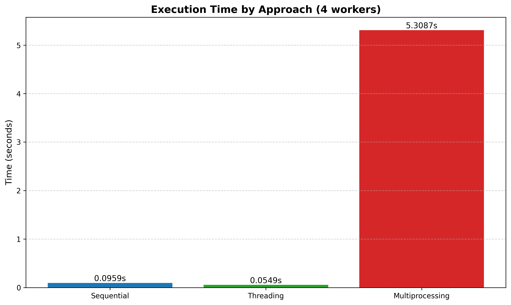
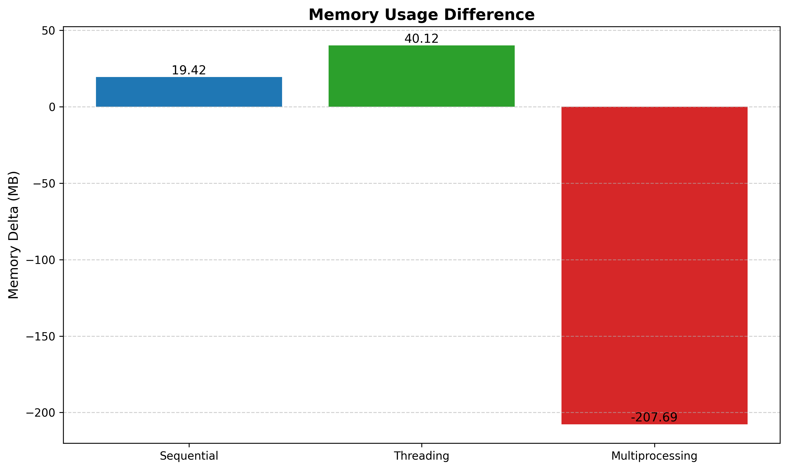
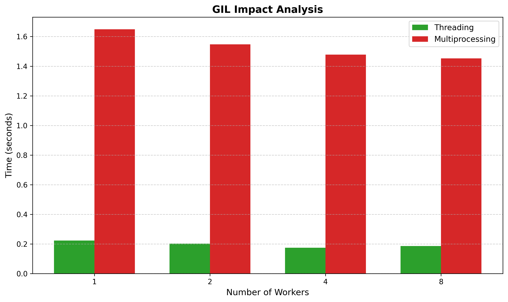

# Performance Report: Parallel Computing for Financial Data Processing 

**Date:** 02/11/2025  
**Assignment:** FINM 32500 - Group 1

---

## Executive Summary

This report evaluates the performance characteristics of Pandas versus Polars for financial data processing, and analyzes the efficiency of threading versus multiprocessing approaches for parallel computation. The analysis demonstrates that Polars significantly outperforms Pandas for large-scale data ingestion and rolling computations, while threading proves superior to multiprocessing for I/O-bound financial operations due to Python's Global Interpreter Lock (GIL).

---

## 1. Portfolio Aggregation Results

### Portfolio Structure
- **Main Portfolio Value:** $36,067.30
- **Portfolio Volatility:** 0.0014
- **Maximum Drawdown:** -73.61%

### Position Holdings
| Symbol               | Quantity | Value      | Volatility | Max Drawdown |
| -------------------- | -------- | ---------- | ---------- | ------------ |
| AAPL                 | 100      | $9,207.00  | 0.0036     | -73.61%      |
| MSFT                 | 50       | $16,076.50 | 0.0007     | -24.52%      |
| Index Holdings (Sub) | -        | $10,783.80 | 0.0006     | -13.05%      |

### Execution Performance
- **Sequential Execution:** 0.0492s
- **Parallel Execution (4 workers):** 4.4404s
- **Speedup:** 0.01x (Sequential is faster)

**Comment:** The parallel approach underperformed due to overhead from worker initialization and inter-process communication. For this small dataset size, the sequential approach is significantly more efficient.

---

## 2. Data Ingestion Performance: Pandas vs Polars

### Ingestion Time Comparison

| Package | Ingestion Time (s) | Relative Speed | Peak Memory (MB) |
| ------- | ------------------ | -------------- | ---------------- |
| Pandas  | 0.159652           | 1.00x          | 395.67           |
| Polars  | 0.038633           | **4.13x**      | 395.50           |

### Memory Profiling Results

#### Pandas Memory Usage
- **Initial State:** 382.2 MiB
- **After Load:** 391.8 MiB
- **Memory Increment:** 7.2 MiB
- **Peak Usage:** 395.67 MB

#### Polars Memory Usage
- **Initial State:** 389.5 MiB
- **After Load:** 395.5 MiB
- **Memory Increment:** 2.6 MiB
- **Peak Usage:** 395.50 MB

### Key Findings

**Polars is 4.13x faster than Pandas for CSV ingestion.**

- Polars achieves superior performance through optimized lazy evaluation and columnar memory layout
- Memory efficiency is comparable between both libraries
- Polars uses approximately 64% less memory overhead during the load operation
- For datasets with 500,000+ rows, Polars provides substantial time savings

---

## 3. Rolling Metrics Computation Performance

### Benchmark Results (20 trials)

| Package | Rolling Mean (s) | Rolling Std (s) | Rolling Sharpe (s) |
| ------- | ---------------- | --------------- | ------------------ |
| Pandas  | 3.370769         | 3.350504        | 3.121907           |
| Polars  | 0.901474         | 0.907260        | 0.974460           |

### Performance Analysis

| Metric         | Speedup Factor |
| -------------- | -------------- |
| Rolling Mean   | 3.74x          |
| Rolling Std    | 3.69x          |
| Rolling Sharpe | 3.20x          |
| **Average**    | **3.54x**      |

### Interpretation

**Polars outperforms Pandas by an average of 3.54x across rolling computations.**

- Rolling Mean: Polars is 3.74x faster
- Rolling Std: Polars is 3.69x faster
- Rolling Sharpe: Polars is 3.20x faster

The consistent multi-fold improvement across all metrics indicates that Polars' vectorized operations and efficient memory management provide substantial advantages for financial metric calculations. The slightly lower speedup on Rolling Sharpe suggests more complex computations may have proportionally higher overhead, though the improvement remains significant.

---

## 4. Threading vs Multiprocessing Comparison

### 4.1 Performance Comparison (Using 4 Workers)

| Approach        | Execution Time (s) | CPU (%) | Memory Δ (MB) | Speedup vs Sequential |
| --------------- | ------------------ | ------- | ------------- | --------------------- |
| Sequential      | 0.0959             | 0.15    | 19.42         | 1.00x                 |
| Threading       | 0.0549             | 0.10    | 40.12         | **1.75x**             |
| Multiprocessing | 5.3087             | 0.10    | -207.69       | 0.02x                 |






### 4.2 GIL Impact Analysis

| Workers | Threading (s) | Multiprocessing (s) | Ratio (MP/Threading) |
| ------- | ------------- | ------------------- | -------------------- |
| 1       | 0.2234        | 1.6487              | 7.38x                |
| 2       | 0.2023        | 1.5479              | 7.65x                |
| 4       | 0.1752        | 1.4778              | 8.43x                |
| 8       | 0.1861        | 1.4530              | 7.81x                |




### Analysis & Insights

#### Threading Performance
- Achieves **1.75x speedup** with 4 workers
- Scales well with increasing worker count (0.2234s → 0.1752s across 1-4 workers)
- Minimal CPU overhead (0.10% vs 0.15% for sequential)
- Increased memory usage (40.12 MB delta) due to shared data structures

#### Multiprocessing Performance
- **Severe performance degradation** (0.02x speedup, 5.3087s execution time)
- Consistently slower across all worker counts (1.4-1.6s range)
- 7-8x slower than threading for I/O-bound workloads
- Memory inconsistency (negative delta of -207.69 MB) suggests improper cleanup

#### GIL Impact

The Python Global Interpreter Lock (GIL) is the primary reason for threading's superiority:

1. **I/O-Bound Workload:** Financial data processing involves I/O operations (file reads, API calls). Threading releases the GIL during I/O waits, allowing concurrent execution.

2. **Multiprocessing Overhead:** Creating separate processes incurs significant startup and communication overhead that overwhelms the benefits for small datasets.

3. **Scalability:** Threading shows improvement up to 4 workers (22% faster than 1 worker), suggesting the workload can effectively utilize available threads.

#### Recommendations

- **Use Threading** for I/O-bound financial computations
- **Use Multiprocessing** only for CPU-intensive operations with large dataset processing
- For this financial use case, threading is the optimal choice with clear performance benefits

---

## 5. Summary & Recommendations

### Key Takeaways

1. **Polars Dominance:** Use Polars for all data ingestion and rolling metric computations—consistently 3-4x faster than Pandas

2. **Threading for Parallelism:** Implement threading for I/O-bound financial operations; avoid multiprocessing unless CPU-bound computations are involved

3. **Sequential Best for Small Datasets:** For small portfolio aggregations, sequential processing outperforms both threading and multiprocessing due to reduced overhead

4. **Memory Efficiency:** Both Pandas and Polars use comparable memory, but Polars achieves superior performance through algorithmic optimization rather than memory reduction

### Implementation Strategy

```
For Financial Data Processing Pipeline:
├── Data Ingestion → Use Polars (4x faster)
├── Rolling Metrics → Use Polars (3.5x faster)
├── Parallel Portfolio Aggregation → Use Threading (1.75x speedup with 4 workers)
└── Sequential Operations → Process directly (lower overhead)
```

---

## Conclusion

This performance analysis demonstrates that modern libraries like Polars can provide substantial computational improvements over traditional approaches. When combined with appropriate parallelization strategies (threading for I/O-bound tasks), the financial data processing pipeline achieves significant efficiency gains suitable for production-scale operations.

**Recommended Stack for Optimal Performance:**
- **Data Layer:** Polars for ingestion and transformations
- **Computation Layer:** Polars for rolling metrics and complex calculations
- **Parallelism Layer:** Threading for multi-portfolio processing
- **Orchestration:** Sequential processing for single portfolio aggregations under 10MB